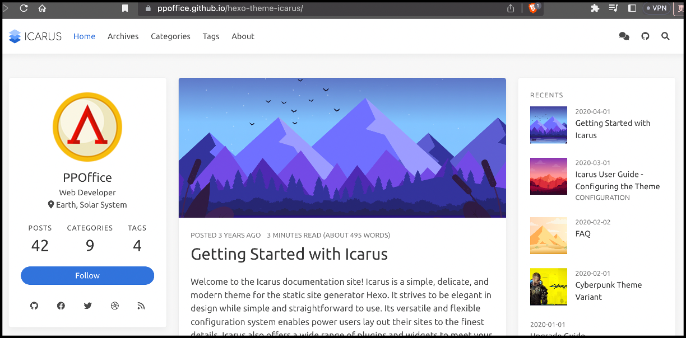
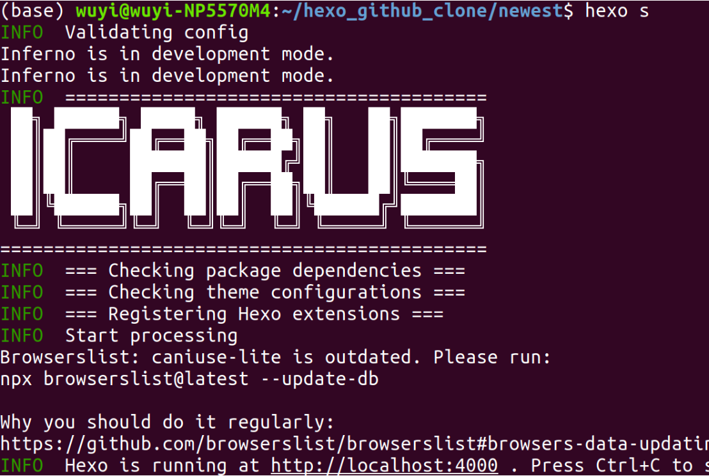
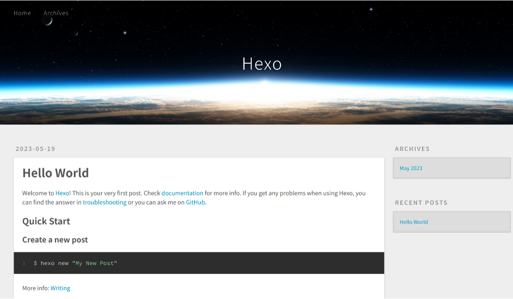
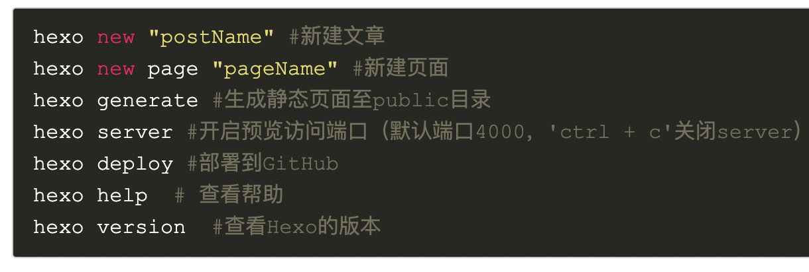
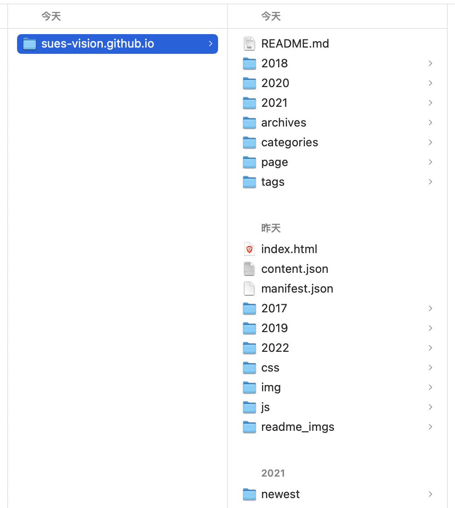
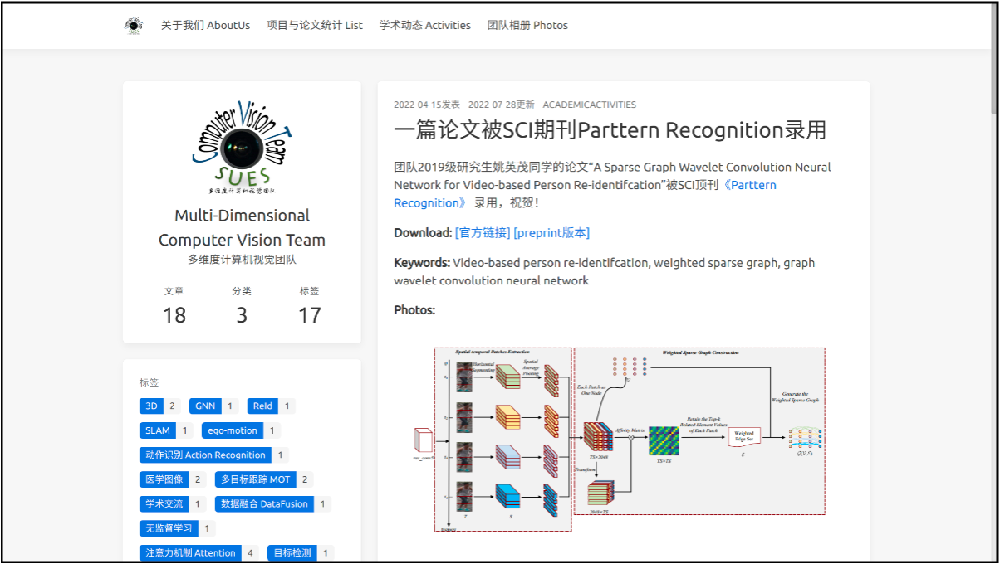

## 团队网站更新 - 操作手册

团队github：https://github.com/sues-vision
主页：https://sues-vision.github.io/

本文档包含：
1. 介绍本网站概况、使用的工具；
2. 说明如何更新网站内容；
3. 仓库说明。

### 一、网站概况
团队网站的内容由静态博客框架 Hexo[1] 生成，后端基于 Github Pages[2] 托管服务。网站基于 Icarus[3] 主题，进行了适当修改。

[1] Hexo 是一个快速、简洁且强大的静态博客框架。该框架具有以下特点：
1. 它基于 Node.js 开发，并且使用 Markdown 作为文章的写作格式。
2. 它提供了一系列的命令行工具，可以轻松地生成静态网页，包括文章、页面、标签和分类等。
3. 它支持自定义主题和插件，使用户能够根据自己的喜好和需求来美化和扩展博客的功能。
4. 它提供了许多丰富的主题和插件，用户能够根据自己的需求，通过简单的配置，添加各种功能，如社交媒体分享、评论系统、站点统计等。

[2] GitHub Pages 是一个由 GitHub 提供的免费静态网站托管服务。它允许用户将他们的网站存储在GitHub仓库中，并通过自定义域名或GitHub提供的子域名进行访问。
使用 GitHub Pages，只需要将网站的源代码和资源文件托管在 GitHub 仓库中，并利用 GitHub 的版本控制功能进行版本管理和协作。当您对网站进行更新或修改时，只需将更改推送到 GitHub 仓库，即可实现网站的自动重新构建与部署。
除了个人和团队网站，GitHub Pages 也可以用于展示开源项目的文档、API文档、技术博客等。它提供了一个便捷且可靠的方式来托管和分享静态网站，无需搭建自己的服务器或购买托管服务。

[3] 相关博客指南
Icarus 主题官网：https://ppoffice.github.io/hexo-theme-icarus/
从零开始搭建自己的Hexo博客：https://www.cnblogs.com/liuxianan/p/build-blog-website-by-hexo-github.html 
如何配置自己的 Icarus 主题：https://blog.csdn.net/Marvine/article/details/89816846 
GitHub文件上传指南：https://mp.weixin.qq.com/s/X2BUGMS6KQLcKeRqWP7a8g 

### 二、网站更新操作步骤
本章节将会首先介绍初次使用要下载的依赖工具，然后是步骤概述，最后是具体更新步骤。

#### 1. 初次使用

a) 确保在电脑上已安装以下工具：
	nodejs: v12.12.0【重要】
	hexo: 5.3.0 or 4.3.0
	git: 2.21.0(windows) or 2.17.1(ubuntu)
	
b) 安装注意事项：
	版本兼容问题（nodejs 与 hexo）：
		https://blog.csdn.net/Feng_ye__/article/details/123024269 
	安装指定版本的 nodejs，并使用 node -v 查看 nodejs 版本：
		https://blog.csdn.net/weixin_38999134/article/details/105620177
		
c) 安装 hexo 后先新建一个文件夹，检测是否安装成功：
	安装：https://blog.csdn.net/qq_37908043/article/details/89066858
	测试：	mkdir hexo_test
		cd hexo_test
		hexo init 创建工程
		hexo s 启动服务，可点击进入 http://localhost:4000/，显示下图，代表已正确安装

d) 常用的 hexo 命令：

#### 2. 更新网站内容过程概述：
	解压 newest.zip，更新网页源码，到 newest->public 中
	将 newest->public 目录下的文件，转移到 sues-vision.github.io 目录下，覆盖原始 2 文件
	将 newest->public 目录下的文件清空，然后压缩 newest，覆盖原始 1 文件
	将 sues-vision.github.io 目录下的所有内容，上传到 GitHub 仓库

#### 3. 更新操作步骤

a) 从 github 下载【最新的】网页源码，到 [sues-vision.github.io] 文件夹。文件可分为 3 类：1. 生成网页源码的 hexo 工程代码（newest）；2. 仓库代码（readme.md and readme_imgs）；3. 网页源码（除了上述 1、2 之外的所有文件）

b) 进入 newest 目录，在终端输入 hero s，即可在本地启动网站

c) 新建博文
	在 newest 目录下运行 hexo new，即可新建博文（markdown文件）
	编辑新建的博文，主要修改 title、tags，以及正文内容
	编辑完成后，使用 hexo s，查看新建的博文在网页上的效果

	
d) 确认效果无误，开始上传到 github 仓库
	1. 终端运行 hexo g，将在 public 文件夹下生成网页源码；
	2. 将 public 下的所有内容转移到 [sues-vision.github.io] 文件夹；
	3. 将 newest 文件夹压缩，覆盖原始的 newest.zip；
	4. 将更新后的 [sues-vision.github.io] 文件夹上传到 GitHub；
	5. 等待两分钟，即可在 https://sues-vision.github.io 看到更新的网站。

### 三、仓库说明

目前有 5 个仓库，其中 1 个为网站相关，2 个为共享资料，2 个为同学实验代码。同学们可根据自己需求新建仓库。

	1. “sues-vision.github.io”存储网站页面源码；
	2. “pre-print-papers”存储已发表论文的预发布版本[4]；
	3. “SharedDocuments”存储有用的/值得分享的文档；
	4. “EfficientFusion-6D”，实验代码；
	5. “C2F-HumanPoseEstimation”，实验代码。

[4] pre-print paper/预发布版本论文
什么是preprint版论文？https://zhuanlan.zhihu.com/p/52779553 

This document is created by atiuo in May, 2023.